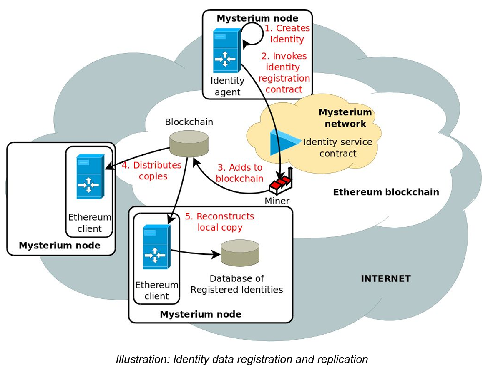
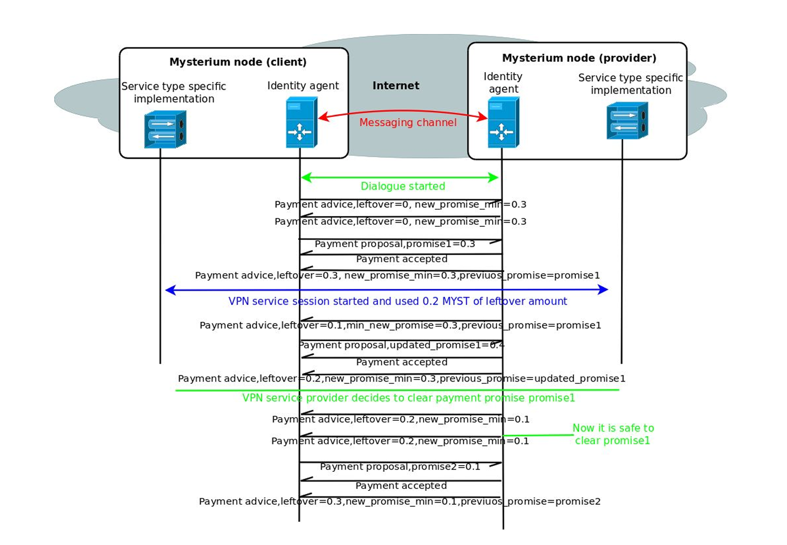
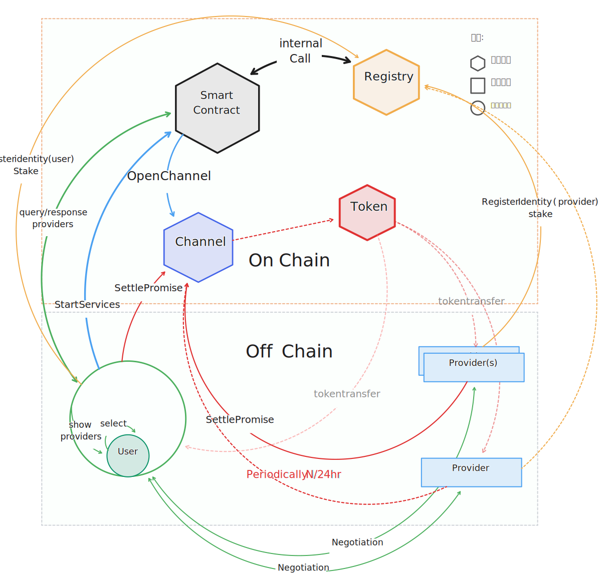

---
# You can also start simply with 'default'
theme: seriph
# random image from a curated Unsplash collection by Anthony
# like them? see https://unsplash.com/collections/94734566/slidev
background: https://cover.sli.dev
# some information about your slides (markdown enabled)
title: Solana Secret Payment System
info: |
    ## Solana Secret Payment System
    Presentation slides for Solana secret payment design.

    References: 
      1. [Confidential Token Extension](https://spl.solana.com/confidential-token/quickstart)
      2. [Mysterium Network Whitepaper](https://5b19bf8d-bbd1-440a-abc6-5752806c93fa.usrfiles.com/ugd/5b19bf_23f6ba0a2028403db1dcd6357f903982.pdf)
# apply unocss classes to the current slide
class: text-center
# https://sli.dev/features/drawing
drawings:
    persist: false
# slide transition: https://sli.dev/guide/animations.html#slide-transitions
transition: slide-left
# enable MDC Syntax: https://sli.dev/features/mdc
mdc: true
---

# Solana Secret Payment System

Presentation slides for Solana secret payment design.

<div @click="$slidev.nav.next" class="mt-12 py-1" hover:bg="white op-10">
  Press Space for next page <carbon:arrow-right />
</div>

<div class="abs-br m-6 text-xl">
  <button @click="$slidev.nav.openInEditor" title="Open in Editor" class="slidev-icon-btn">
    <carbon:edit />
  </button>
</div>

<!--
The last comment block of each slide will be treated as slide notes. It will be visible and editable in Presenter Mode along with the slide. [Read more in the docs](https://sli.dev/guide/syntax.html#notes)
-->

---
transition: fade-out
layout: two-cols-header
---

# How does the Mysterium Network Payment Work?

先从一般的思维来拆解：

```ts {all|1|2-4|5-7|8-10|all}{lines:true}
1. 用户付钱订阅 (Pay-as-you-go/subscription)
2. 用户连接服务 (Connect to the service)
  1. 服务端 check 用户是否具有权限
  2. 服务端 check 用户是否具有余额
3. 用户使用服务 (Use the service)
  1. 服务端实时计费/量
  2. 服务端实时扣费
4. 用户断开服务 (Disconnect from the service)
  1. 用户和服务协商断开
```

::left::

<v-clicks>
<span style="opacity:40%;">那么 Mysterium 产品运作逻辑如何的呢？</span>

````md magic-move v-after
```ts
1. 用户付钱订阅 (Pay-as-you-go/subscription)
  1. Mysterium 多币种支付：ETH, BTC, USDT, SOL...
  2. 直接支付 MYST token
```

```ts
1. 用户付钱订阅 (Pay-as-you-go/subscription)
  1. Mysterium 多币种支付：ETH, BTC, USDT, SOL...
    1. 用户通过 coingate 进行多币种支付 (KYC) 以及最终兑换为 MYST
  2. 直接支付 MYST token
    1. Mysterium 通过 EVM 同款算法 ECDSA + Keccak256 算出一个 Unique Address 作为用户 ID
    2. 依据用户 ID + 关键合约 Addresses 通过一个算法求出一个链上地址 (A), 要求用户 transfer 一定数量的 MYST 到该地址 (A)
      1. Mysterium 客户端持续监听该地址 (A) 上的交易，一旦交易成功，便向 HermesImpl 合约发起 Register Identity 交易
          - 该交易会将用户的 ID 存入 HermesImpl 合约中，从而链上注册该用户
          - A 地址后续会被用来部署 ChannelImpl 合约 -- create2 合约
```
````
</v-clicks>
::right::

<div class="flex justify-right">
  
</div>

---
transition: fade-out
layout: two-cols-header
---

# How does the Mysterium Network Payment Work?

<span class="m-0" style="font-size:14px">前情提要：用户 ID 已经被注册到 HermesImpl 合约中，接下来我们来看看用户连接服务的过程：</span>

::left::

<div class="text-sm">
  <span  class="text-lg text-bold">用户连接服务</span>
  <ol>
    <li v-click>
      Mysterium Client 检索链上信息，找到 Providers, 展示给用户，让用户选择
    </li>
    <li v-click="2">
      用户选择一个 Provider
    </li>
    <li v-click="3">
      Mysterium Client 向 Provider 发起连接请求
      <ul>
        <li>连接请求中包含用户 ID, 资费讯息等等</li>
      </ul>
    </li>
    <li v-click="4">
      Provider 收到连接请求后，检查用户 ID 是否存在于 HermesImpl 合约中
      <ul>
        <li>如果存在，便向用户发送连接请求并且<Negotiation class="top-0 m-0 p-0" /></li>
        <li>如果不存在，便向用户发送连接请求失败</li>
      </ul>
    </li>
    <li v-click="5">
      <a>协商</a>成功之后，用户和 Provider 通过 HermesImpl 合约创建一个 Channel
      <ul>
        <li>用于用户和 Provider 之间的 Settle Promise (状态通道资金结算)</li>
      </ul>
    </li>
  </ol>
</div>

::right::



<style>
/* styles.css */

.slidev-vclick-target {
  transition: opacity 500ms ease;
  @apply opacity-100;
}

.slidev-vclick-hidden {
  transform: scale(0.8);
 @apply text-gray opacity-40;
}
</style>

<!--
You can have `style` tag in markdown to override the style for the current page.
Learn more: https://sli.dev/features/slide-scope-style
-->

---
transition: fade-out
layout: image-right
image: ./assets/imgs/Negotiation.png
class: scale-100
---

# How does the Mysterium Network Payment Work?


````md magic-move 
```ts {all|2-3}{lines:true}
用户使用服务 (传统模式)
    1. 服务端实时计费/量
    2. 服务端实时扣费
```

```ts {all|2-4|5-9|all}{lines:true}
用户使用服务 (状态通道)
    1. 链下 client-client 记录使用情况/扣费信息
        - user 和 provider 共同维护一个链下 ledger
        - P2P/router/... 消息通讯用量/扣费信息
    2. 链上定期扣费
        - provider 设置一个 period 进行
          链上 Settle Promise(状态通道资金结算)
        - Settle Promise 会将链下 ledger 中的
          最后一条信息转移到链上，从而进行资金结算转移
```

```ts {all|11-14}{lines:true}
用户使用服务 (状态通道)
    1. 链下 client-client 记录使用情况/扣费信息
        - user 和 provider 共同维护一个链下 ledger
        - P2P/router/... 消息通讯用量/扣费信息
    2. 链上定期扣费
        - provider 设置一个 period 进行
          链上 Settle Promise(状态通道资金结算)
        - Settle Promise 会将链下 ledger 中的
          最后一条信息转移到链上，从而进行资金结算转移

用户断开服务 (状态通道)
    1. 用户和 Provider 协商断开
    2. 链上 Settle Promise(状态通道资金结算)
    3. 链上关闭 Channel
```
````

---
transition: fade-out
layout: iframe
url: ./assets/pdf/MysteriumRelationship.pdf
---

Mysterium smart contract relationship


---
transition: fade-out
layout: two-cols-header
---

# Solana Secret Payment System

<div class="space-x-4 text-sm opacity-40">
  <span>solana 上的 secret payment 设计 - Solana State Channel</span>
  <span>·</span>
  <span>链上处理资金，链下维护账本的方式值得学习</span>
</div>

::left::

```rust {all|1-2|3-8|9-12|13-18|19-21}
1. 用户通过 crypto-crypto 方式获取到 WZT
2. 向主合约调用 Register Identity 交易 (同时传入 WZT), 进行链上身份 (User/Provider) 注册
3. 匿名网络客户端获取链上信息，找到 Providers, 展示给用户，让用户选择。
  * Providers 的信息：
      - Identity
      - 地理信息
      - 资费讯息
      - 信誉度, etc...
4. 用户选择一个/多个 Provider(s), 构建起代理电路。
  1. 用户和 Provider(s) 之间进行协商。(Negotiation)
  2. 用户和 Provider(s) 之间建立起状态通道 (State Channel)。
  3. 用户和 Provider(s) 之间进行数据传输。(Relay)
5. 用户和 Provider(s) 之间进行 ledger 维护。
  1. 根据用户链上资金余额进行定期 Settle Promise (solana 机密转账)
    1. 余额越少，Settle Promise 越频繁 (周期短)
    2. 余额越多，Settle Promise 越不频繁 (周期长)
  2. 链上 Settle Promise 会将链下 ledger 中的
     最后一条信息转移到链上，从而进行资金结算转移
6. 用户断开服务
  1. 用户和 Provider(s) 之间进行断开协商。(Negotiation)
  2. 用户和 Provider(s) 之间进行 Settle Promise。(State Channel)
```

::right::

   <div class="full-right">
        <iframe class="sol-web" src="https://spl.solana.com/confidential-token/quickstart" title="confidential-token"></iframe>
    </div>

  <style>
        /* 父元素样式 */
       .full-right {
            display: grid;
            padding-left: 10px;
            width: 100%;
            height: 100%;
        }

        /* 子元素样式 */
       .sol-web {
            width: 100%;
            height: 100%;
            border: none; /* 去掉默认边框 */
        }
    </style>

---
transition: fade-out
layout: two-cols-header
---

# Solana Secret Payment System

在这个系统设计中，如何保证匿名性呢？

1. 在 Mysterium 的方案中，用户的使用量/时间可以通过链上记录来进行统计。
    1. ${\text{使用量}=\frac{\sum_i^n{Settle Promise_i}}{x Gb/MYST}}$
    2. ${\text{时间}= {Settle Promise Time_{max_i}} -  {Channel Open Time_{i}}}$

而且在 Solana 中，可以使用 Solana 的 `Confidential Token` 来进行支付。

```ts {all|1-2|3-4|5-6|all}{lines:true}
Confidential Token (支持机密转账)
  - 机密传输：支持在 Solana 网络上进行机密代币的创建、存储和转移，确保交易细节对外部观察者不可见。
  - 交易隐私：在进行机密代币转账时，交易细节对外部不可见，增强用户隐私保护。
  - 账户配置：用户可为其代币账户启用机密传输功能，确保账户余额和交易对外部不可见。
  - 代币存款和取款：用户可以将非机密代币存入机密账户，或将机密代币取出到非机密账户，实现代币的隐私管理。
  - 账户余额管理：用户可以管理账户的待处理余额，确保所有代币在进行交易前已准备就绪。 
```
<v-clicks>

  ✨ 使用 Confidential Token 来进行支付 (Settle Promise), 可以**避免第三方推断用户的使用量**的问题。
  
  <br>
  <span class="text-2xl font-bold">👻 还有一个问题：如何避免查看链上交易记录进而推断用户的使用时间段呢？</span>

</v-clicks>

---
transition: fade-out
---

# How to protect the user's time?

<span class="text-sm gray">定义 · <HoverMe trigger="实时资金结算" inner="资金结算时间间隔 < 300s"/>：资金结算时间间隔 < 300s · <HoverMe trigger="匿名时间范围" inner="匿名时间持续 1 天 / 24 hrs"/>：1 天 / 24 hrs</span>

<HoverMe trigger="方案：" triggerClass="text-xl" inner="" />

<v-click>

1. 非实时资金结算
    - 用户和 Provider(s) 之间协商资金结算间隔：例如 1 hr, 4 hr(s), ...
        1. 🔼 时间间隔越大，则匿名性越高，但是对用户 <HoverMe trigger="要求越高" inner="🔼 需要用户 stake 多或者 reputation 较高" triggerClass="text-xl text-green-700" direction="up"/>
        2. 🔽 时间间隔越小，则匿名性越低，但是对用户 <HoverMe trigger="要求越低" inner="🔽 需要用户 stake 少或者 reputation 一般" triggerClass="text-sm text-red-700"/>
        3. 当 stake 的资金足够时，两方都认可时，才会正式开始建立链接

</v-click>

<v-click>

2. 实时资金结算
    - 用户和 Provider(s) 协商出一个预留资金 (tx fee(s) + 小额转账余额), 然后用户再 stake 适当的资金
    - 当 stake 的资金足够时，两方都认可时，才会正式开始建立链接
    - 用户和 Provider(s) 之间 <HoverMe trigger="实时资金结算" inner="用户和 Provider(s) <= 30s 进行一次 Settle Promise, 直到 Stake 资金快见底或者用户主动断开服务"/>
  
</v-click>

<v-click>

无论是实时/非实时资金结算，最终都会由 Provider(s) 去触发 Settle Promise(s), 进而实现 1 天内的资金转账记录，让分析者无法确认用户**实际使用时间段**。

</v-click>

---
transition: fade-out
layout: iframe
# url: https://www.tldraw.com/f/Mpe9TktB1yCo1WB_PumO0?d=v-564.-335.2525.1701.2xw6v58kaC-p3eMcAIRHH
url: https://www.tldraw.com/p/szipTo2OP25Rh83CyeSEx?d=v-564.-335.2525.1701.2xw6v58kaC-p3eMcAIRHH
---

